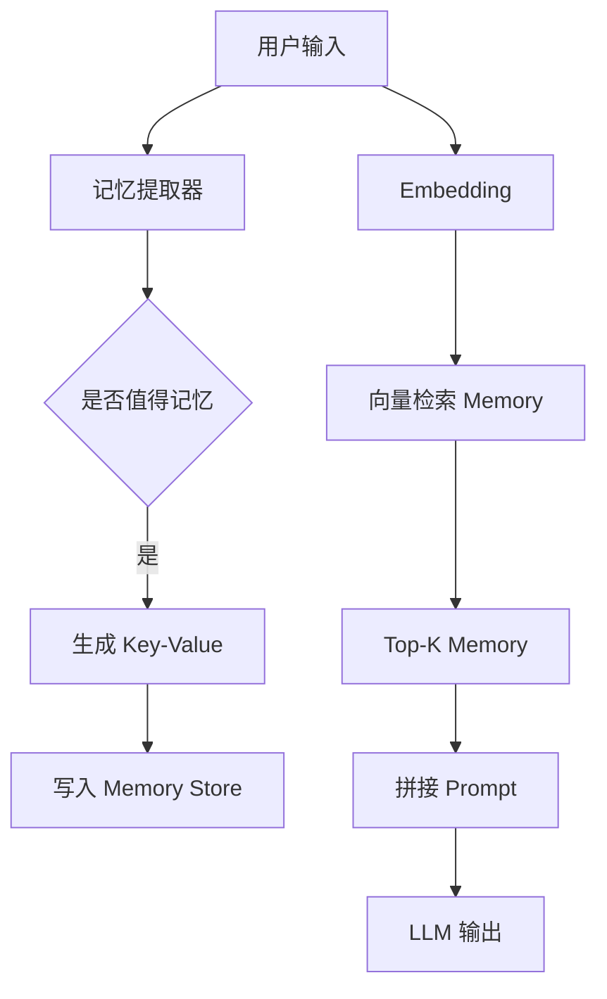
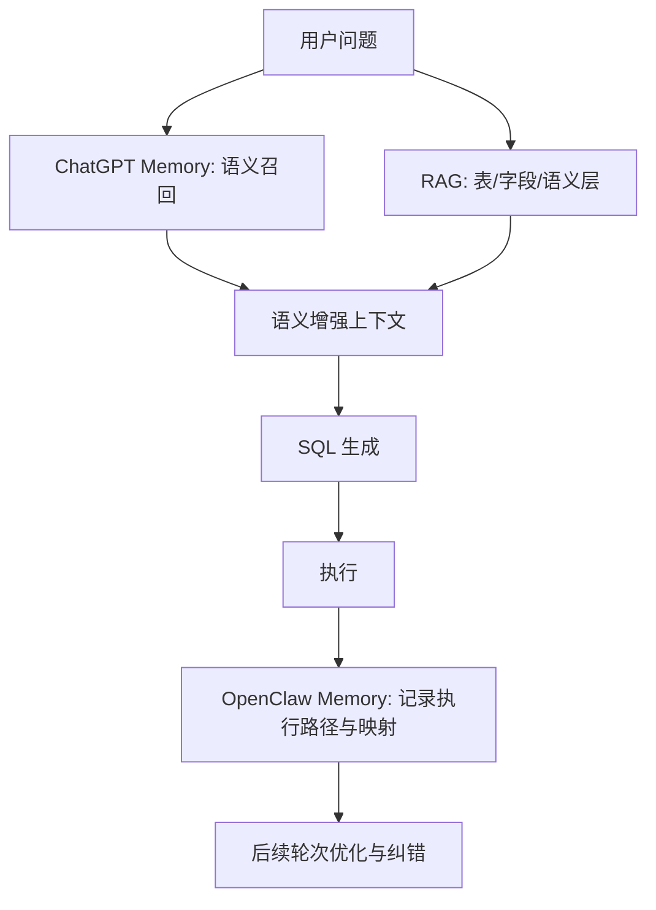

# 技术选型文档：长期记忆机制（ChatGPT KV Memory vs OpenClaw Agent Memory）

| 项目 | 说明 |
|------|------|
| 文档类型 | 技术选型 / 架构说明 |
| 适用场景 | ChatGPT 类对话系统、NL2SQL + RAG + Semantic Layer、自动化 Agent |
| 修订日期 | 2026-03-31 |

---

## 1. 背景与目标

在构建 **NL2SQL + RAG + Semantic Layer** 类系统时，需要区分两类「记忆」能力：

1. **语义长期记忆**：跨会话理解用户偏好、项目上下文、指标习惯等。
2. **执行轨迹记忆**：记录工具调用、SQL 成败、字段映射修正等可回放信息。

本文从 **架构、数据结构、读写流程、与 Transformer KV Cache 的区别、工程实现与选型** 五个层面，说明 **Key–Value 长期记忆** 与 **OpenClaw 式 Agent Memory** 的差异，并给出 **NL2SQL 场景下的组合选型结论**。

---

## 2. 术语边界：两种「KV」不要混淆

| 类型 | 名称 | 作用 | 生命周期 | 存储内容 |
|------|------|------|----------|----------|
| 短期 | **Transformer KV Cache** | 加速自回归推理 | 单次对话 / 单次请求 | Token 级 attention 的 K/V |
| 长期 | **Key–Value Memory** | 可检索的用户/任务上下文 | 跨会话持久化 | 语义索引 Key + 结构化 Value |

**本文选型对象**为第二行：**Key–Value Memory（长期记忆）**，不是推理时的 KV Cache。

### 2.1 长期记忆的本质定义

```text
Key   = 可检索的语义索引（通常实现为 embedding(语义表达)）
Value = 结构化用户信息 / 上下文（含类型、置信度、时间等元数据）
```

**典型记录示例：**

```json
{
  "key": "用户偏好_技术方向",
  "embedding": [0.12, "..."],
  "value": {
    "content": "用户是数据产品经理，关注 NL2SQL",
    "confidence": 0.92,
    "timestamp": 1710000000
  }
}
```

---

## 3. 方案一：ChatGPT 类 Key–Value Memory（语义记忆）

### 3.1 整体架构



### 3.2 数据结构设计

| 组件 | 设计要点 |
|------|----------|
| **Key** | 多为 `embedding(语义表达)`，来源可为用户属性、偏好、长期目标、历史行为摘要等。 |
| **Value** | 结构化字段：`type`、`content`、`source`（explicit \| inferred）、`confidence`、`ttl`、`timestamp` 等。 |
| **Memory Store** | 常见组合：向量检索（FAISS / Milvus 等）+ 元数据（Redis / DynamoDB 等），或统一向量库带 payload。 |

**Value 示例：**

```json
{
  "type": "user_profile",
  "content": "用户是数据产品经理",
  "source": "explicit | inferred",
  "confidence": 0.9,
  "ttl": null,
  "timestamp": 1710000000
}
```

### 3.3 写入流程（Memory Write）

| 步骤 | 说明 |
|------|------|
| 1. Memory Extraction | 从对话中抽取稳定事实（如职业、当前项目）。 |
| 2. Memory Scoring | 过滤：`score ≈ relevance × persistence × uniqueness`，只保留长期、高价值信息。 |
| 3. 生成 Key–Value | `key = embed(语义摘要)`，`value` 带类型与置信度。 |
| 4. 去重 / 合并 | 聚类或相似度合并，避免「数据产品经理 / 数据产品 / 数据岗」多条冗余。 |

### 3.4 读取流程（Memory Retrieval）

| 步骤 | 说明 |
|------|------|
| 1. Query Embedding | 对当前用户问题做 embedding。 |
| 2. 向量召回 | Top-K 相关 memory。 |
| 3. Memory Ranking | 如 `score = similarity + recency + confidence`。 |
| 4. 注入 Prompt | 拼成系统上下文或独立 memory 块。 |

### 3.5 工程难点（影响选型权重）

| 难点 | 表现 | 缓解方向 |
|------|------|----------|
| 写入污染 | 存太多、存错 | 提高阈值、可选人工审核 |
| 冲突 | 旧事实与新事实矛盾 | 版本号、latest-wins、按置信度加权 |
| 过度召回 | 上下文膨胀 | Top-K（如 3～10）、token budget |
| 语义漂移 | 同义不同形导致漏召/错召 | 语义归一、别名表（alias mapping） |

### 3.6 最小工程骨架（示意）

```python
class MemoryStore:
    def write(self, text):
        emb = embed(text)
        self.db.insert({
            "embedding": emb,
            "content": text
        })

    def retrieve(self, query):
        emb = embed(query)
        return self.db.topk(emb, k=5)
```

### 3.7 进阶能力（「ChatGPT 级别」系统常见增强）

- **Memory 分层**：`user_profile` / `preferences` / `tasks` / `constraints` 等。
- **Episodic vs Semantic**： episodic 偏某次对话片段；semantic 偏抽象可复用知识。
- **Memory Graph**：实体关系（用户 → 项目 → 技术 → 数据表）的轻量图结构，辅助检索与消歧。

### 3.8 与 NL2SQL 系统的关系

| 形态 | 数据流 |
|------|--------|
| 当前常见 | `RAG → SQL` |
| 升级形态 | `Memory（用户上下文） + RAG（schema / 语义层） → NL2SQL Agent` |

Memory 可影响 SQL 风格、指标选择、表优先级等；需与 RAG 解耦职责：**RAG 管「库内知识」，Memory 管「用户侧稳定上下文」**。

**一句话**：ChatGPT 类 KV 记忆 = **用向量索引的 Key + 结构化 Value，实现可检索的长期上下文注入**。

---

## 4. 方案二：OpenClaw 类 Agent Memory（执行记忆）

### 4.1 机制概要

| 维度 | 说明 |
|------|------|
| 记忆本质 | 任务轨迹：action log + 中间状态 + 工具输出 |
| 写入 | 每步操作显式记录，非「抽取摘要」为主 |
| 读取 | 按当前任务回放 history，决策下一步 |
| 结构 | JSON / 日志 / 状态树 |

**写入路径（示意）：**

```text
每一步操作 → 记录
```

**存储示例：**

```json
{
  "step": 3,
  "action": "click_button",
  "target": "提交",
  "result": "success"
}
```

**本质**：`Memory = execution trace`（执行轨迹），而非通用语义检索系统。

### 4.2 在 NL2SQL 中的长短板

| 优势 | 劣势 |
|------|------|
| 可精确记录上次 SQL、成功字段、执行反馈 | 长任务下日志膨胀，抽象复用难 |
| 确定性强、可追溯 | 泛化弱，难以单靠轨迹回答「全新问题」 |

---

## 5. 选型对比矩阵

### 5.1 总表

| 维度 | ChatGPT KV Memory | OpenClaw Agent Memory |
|------|-------------------|------------------------|
| 记忆本质 | 语义索引（embedding KV） | 任务轨迹（action + context） |
| 粒度 | 用户 / 知识级 | 操作 / 任务级 |
| 读写方式 | 自动抽取 + 向量召回 | 显式记录 + replay |
| 结构 | KV + 向量库 + 元数据 | JSON / 日志 / 状态树 |
| 主要用途 | 上下文增强、个性化 | 自动化执行、流程接续 |
| 稳定性 | 高（依赖向量与 schema 设计） | 中（路径依赖、错误传播） |
| 可控性 | 中（召回不透明） | 高（逐步可追溯） |
| 工程复杂度 | 中高（抽取、过滤、去重、别名） | 中（记录与裁剪策略） |
| 典型适合场景 | 对话、推荐、NL2SQL 语义增强 | 自动操作、强流程 Agent |

### 5.2 落地维度对比

| 落地维度 | ChatGPT KV Memory | OpenClaw Agent Memory |
|----------|--------------------|------------------------|
| 数据结构复杂度 | embedding + metadata；schema 与 alias 成本高 | JSON log + state；易膨胀 |
| 检索能力 | 语义强、跨任务泛化；依赖 embedding 质量 | 基于历史精确、确定性强；泛化弱 |
| 写入成本 | 高（抽取 + 过滤 + embedding） | 低（直接追加） |
| 可解释性 | 弱（为何召回某条不透明） | 强（逐步可追溯） |
| 典型失效 | 语义错配导致错字段（如 task_id ≠ mission_id） | 错误沿轨迹传播 |

### 5.3 本质差异（选型口诀）

```text
ChatGPT KV Memory：记「是什么」（knowledge）
OpenClaw Memory：记「怎么做」（procedure）
```

---

## 6. 选型结论与推荐架构（NL2SQL）

### 6.1 结论：**不做二选一，采用组合**

| 层 | 技术选型 | 承担职责 |
|----|----------|----------|
| 语义记忆 | ChatGPT 类 KV Memory | 用户偏好、语义别名、常用指标、项目上下文 |
| 执行记忆 | OpenClaw 类 Agent Memory | SQL 成功案例、字段映射、失败修正路径 |
| 数据知识 | RAG + Semantic Layer | 表 / 字段 / 指标定义 |

### 6.2 推荐组合架构



### 6.3 针对「字段错 + RAG 失效」的增强：**Field Mapping Memory**

在纯 RAG + LLM 之上，建议增加 **字段级经验记忆**（可视为执行记忆与结构化规则的融合），示例 schema：

```json
{
  "wrong": "task_id",
  "correct": "mission_id",
  "table": "dwd_task_info"
}
```

该类记忆对 **NL2SQL 纠错** 往往比单纯扩大 RAG 片段更直接。

### 6.4 一句话结论

- **ChatGPT Memory** 主要解决 **「理解问题」**（用户与语义上下文）。
- **OpenClaw Memory** 主要解决 **「执行问题」**（轨迹与落地反馈）。
- NL2SQL 场景下，缺口常在于：**缺少字段级经验记忆层（Execution Memory 与 Semantic Memory 的融合）**。

---

## 7. 工程落地检查清单

| 序号 | 项 | 说明 |
|------|----|------|
| 1 | 向量库与元数据 | 选定向量引擎 + 元数据存储，定义统一 `memory_id`、租户隔离 |
| 2 | 写入策略 | 阈值、去重合并、TTL、冲突策略（版本 / latest-wins） |
| 3 | 读取策略 | Top-K、token 上限、排序公式（相似度 + 时效 + 置信度） |
| 4 | 别名与归一 | 业务词 → 标准字段 / 指标 ID 的映射表，与向量记忆联动 |
| 5 | 执行侧日志 | 成功 SQL、错误信息、修正动作写入 Agent Memory，供下轮引用 |
| 6 | 观测与回滚 | 抽样审计记忆质量；支持按用户 / 会话清理污染条目 |

---

## 8. 后续可深化专题（可选）

- Memory Schema 定稿（可直接落库、含索引字段）。
- NL2SQL Memory-aware Agent 整体架构（如 V3）。
- 从 SQL 执行结果与错误日志 **反向学习** 字段映射的规则与记忆写入策略。

---

## 9. 附录：进阶 Memory 类型枚举（参考）

```text
- user_profile
- preferences
- tasks
- constraints
```

（实际生产可按业务拆表或分 collection，并配套 ACL 与留存策略。）
